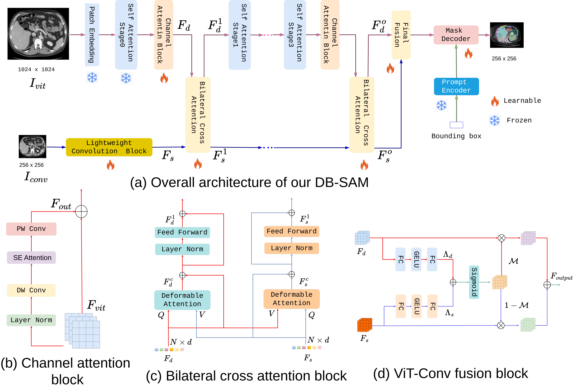
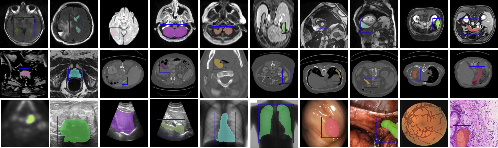

# DB-SAM
This repository is an official implementation of the paper [DB-SAM: Delving into High Quality
Universal Medical Image Segmentation]. (MICCAI-2024 Oral)
  

  

## Abstract
Recently, the Segment Anything Model (SAM) has demonstrated promising segmentation capabilities in a variety of downstream
segmentation tasks. However in the context of universal medical image
segmentation there exists a notable performance discrepancy when
directly applying SAM due to the domain gap between natural and
2D/3D medical data. In this work, we propose a dual-branch adapted
SAM framework, named DB-SAM, that strives to effectively bridge this
domain gap. Our dual-branch adapted SAM contains two branches in
parallel: a ViT branch and a convolution branch. The ViT branch incorporates a learnable channel attention block after each frozen attention
block, which captures domain-specific local features. On the other hand,
the convolution branch employs a light-weight convolutional block to
extract domain-specific shallow features from the input medical image.
To perform cross-branch feature fusion, we design a bilateral cross-attention block and a ViT convolution fusion block, which dynamically
combine diverse information of two branches for mask decoder. Extensive
experiments on large-scale medical image dataset with various 3D and
2D medical segmentation tasks reveal the merits of our proposed con-
tributions. On 21 3D medical image segmentation tasks, our proposed
DB-SAM achieves an absolute gain of 8.8%, compared to a recent med-
ical SAM adapter in the literature.

## Usage
## Installation
### Requirements
  
* Python>= 3.10

    We recommend you to use Anaconda to create a conda environment:
    ```bash
    conda create -n SAM python=3.10 pip
    ```
    Then, activate the environment:
    ```bash
    conda activate SAM
    ```
  
* PyTorch>=1.13.0, torchvision>=0.14.0 (following instructions [here](https://pytorch.org/))

    For example, you could install pytorch and torchvision as following:
    ```bash
    conda install pytorch==1.13.0 torchvision==0.14.0 torchaudio==0.13.0 pytorch-cuda=11.6 -c pytorch -c nvidia
    ```
  
* Other requirements
    ```bash
    pip install -r requirements.txt
    ```

* Compiling CUDA operators for installing the Deformable-Attention
   
   We recommend to refer the [Deformable-DETR](https://github.com/fundamentalvision/Deformable-DETR)
